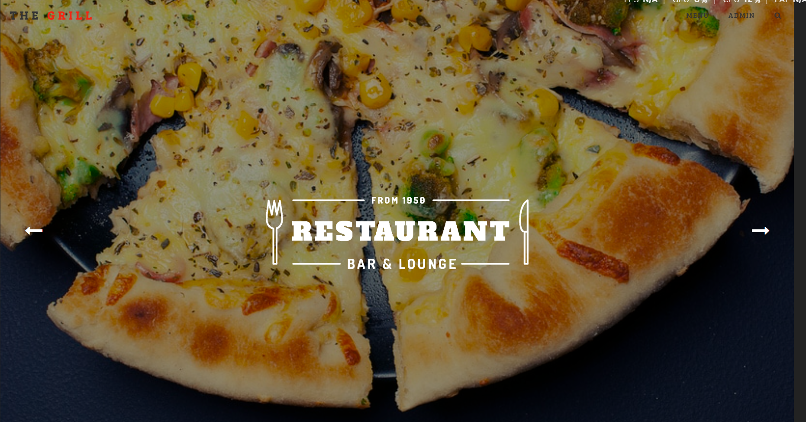
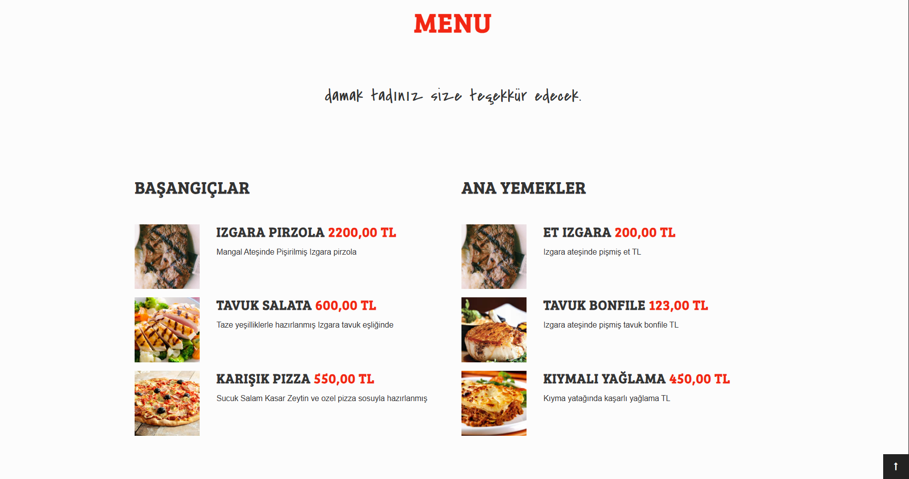
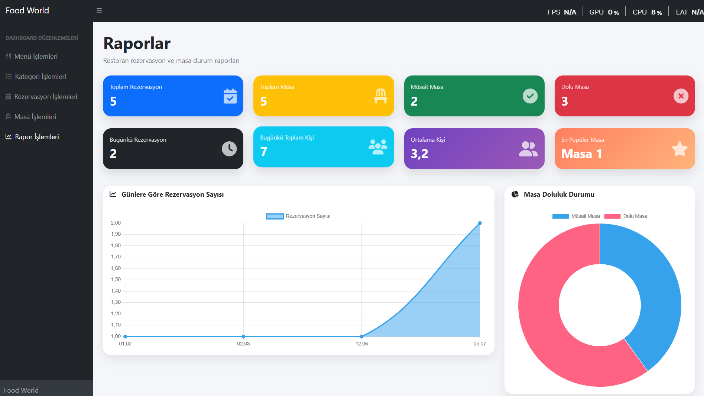
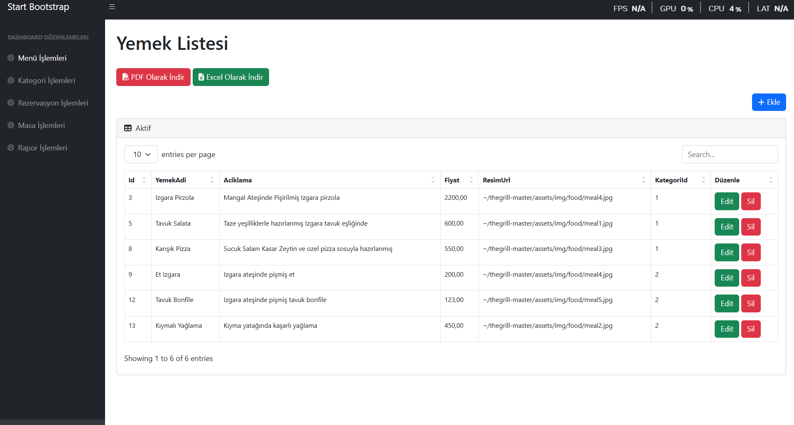
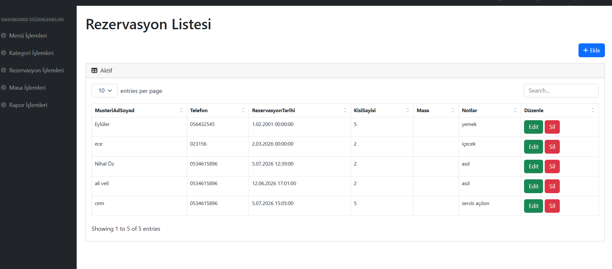
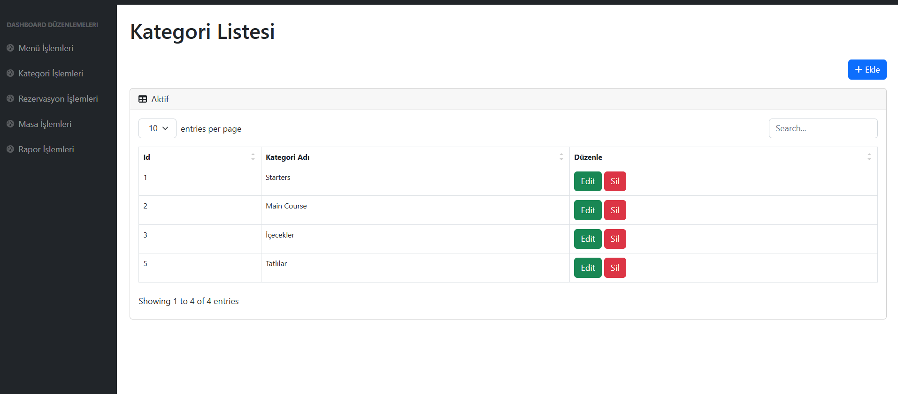
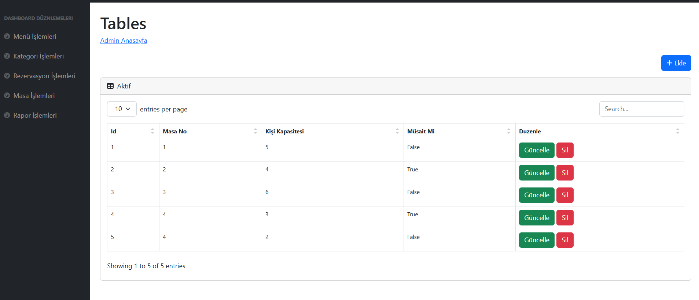

<!-- HEADER -->

<div align="center">

# 🍽️ The Grill

### Modern Restaurant Management System with ASP.NET Core MVC & Entity Framework Core

A modern restaurant management application built using ASP.NET Core MVC, Entity Framework Core, SQL Server and Bootstrap. The project includes menu management, reservations, table management, reporting dashboard, PDF & Excel export features.

---


</div>

---

# 📸 Project Screenshots

## Home Page



---

## Menu



---
## Admin Dashboard


---

## Menu Management



---

## Reservation Page



---

## Category Management



---

## Table Management



---

## Reservation Management


---


# 🚀 Project Features

### 👨‍🍳 Customer Side

- Home Page
- Restaurant Menu
- Food Categories
- Online Reservation
- Responsive Design

---

### 🛠 Admin Panel

- Dashboard
- Menu CRUD
- Category CRUD
- Table CRUD
- Reservation CRUD
- Restaurant Reports
- PDF Export
- Excel Export

---

### 📊 Reporting Dashboard

- Total Reservations
- Total Tables
- Available Tables
- Occupied Tables
- Today's Reservations
- Today's Customers
- Average Customer Count
- Most Popular Table
- Daily Reservation Chart
- Reservation by Tables Chart
- Table Occupancy Chart

---

# 🏗 Project Architecture

```text
TheGrill

│

└── ASP.NET Core MVC

    ├── Entity Framework Core

    ├── SQL Server

    ├── Bootstrap 5

    ├── Razor Views

    ├── LINQ

    ├── Chart.js

    ├── QuestPDF

    └── EPPlus
```

---

# 🛠 Technologies

| Backend | Frontend | Database | Other |
|----------|----------|----------|--------|
| ASP.NET Core MVC | Bootstrap 5 | SQL Server | Entity Framework Core |
| C# | HTML5 | Code First | LINQ |
| Razor | CSS3 | Migration | Chart.js |
| MVC Pattern | JavaScript | | QuestPDF |
| CRUD Operations | Responsive Design | | EPPlus |

---

# 📊 Modules

✔ Dashboard

✔ Menu Management

✔ Category Management

✔ Table Management

✔ Reservation Management

✔ Reporting Dashboard

✔ Daily Reservation Statistics

✔ Table Occupancy Statistics

✔ PDF Report Export

✔ Excel Report Export

✔ Responsive Admin Panel

---

# 📂 Database Tables

| Table |
|---------|
| Categories |
| Menus |
| Tables |
| Reservations |

---

# 🎯 Learning Outcomes

- ASP.NET Core MVC
- Entity Framework Core
- Code First Approach
- SQL Server
- LINQ Queries
- CRUD Operations
- Bootstrap Dashboard Design
- Chart.js Integration
- PDF Report Generation
- Excel Report Generation
- Responsive Web Design

---

# ⭐ Project Status

✅ Completed

---

<div align="center">

Made with ❤️ using ASP.NET Core MVC

</div>
